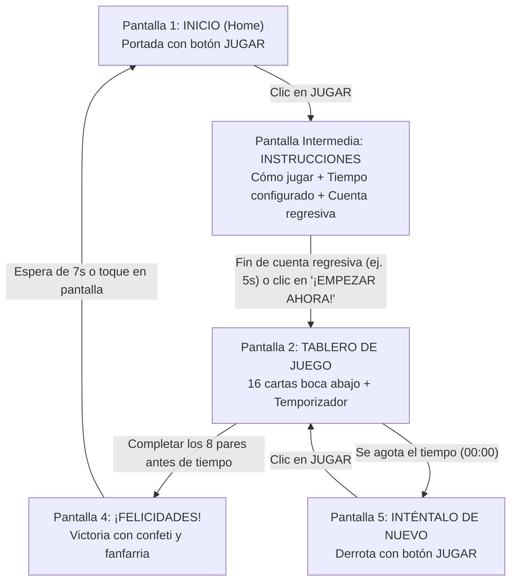

# Abbott Memorice — Juego Interactivo para Stand / Kiosko Vertical (1080×1920)

Aplicación web interactiva desarrollada para Abbott, diseñada como una réplica visual y funcional 1:1 de los diseños originales para tótems y pantallas táctiles verticales en congresos, ferias médicas y eventos.

* **URL de Producción en Vercel**: [https://abbott-ashy.vercel.app](https://abbott-ashy.vercel.app)
* **Repositorio en GitHub**: [https://github.com/Dyfog/abbott-memorice](https://github.com/Dyfog/abbott-memorice)
* **Panel de Control en Vercel**: [https://vercel.com/dyfogs-projects/abbott](https://vercel.com/dyfogs-projects/abbott)

---

## 1. Especificaciones de Pantalla y Diseño

* **Resolución nativa**: 1080 × 1920 píxeles (Aspect ratio **9:16 vertical / portrait**).
* **Entorno de uso**: Tótems interactivos, pantallas táctiles verticales, atriles de eventos y stands de conferencias.
* **Comportamiento responsive**:
  * En una pantalla vertical de 1080×1920 ocupa el 100% del área sin barras ni scroll.
  * En pantallas de escritorio horizontales (laptops o monitores panorámicos), se auto-centra manteniendo la proporción exacta 9:16 con un contenedor simulador de kiosko.
* **Control táctil**: Deshabilitado el zoom gestual accidental (`user-scalable=no`), doble toque de ampliación y selección de texto indeseada.

---

## 2. Mecánica del Juego

* **Tablero**: Cuadrícula de **4 filas × 4 columnas (16 cartas en total)**.
* **8 pares idénticos** basados en los 4 productos líderes de Abbott Nutrición:
  1. **PediaSure (Lata)** × 2
  2. **PediaSure (Logo)** × 2
  3. **PediaSure 10+ (Lata)** × 2
  4. **PediaSure 10+ (Logo)** × 2
  5. **Glucerna (Lata)** × 2
  6. **Glucerna (Logo)** × 2
  7. **Ensure Advance (Lata)** × 2
  8. **Ensure Advance (Logo)** × 2
* **Barajado**: Algoritmo de Fisher-Yates que genera una disposición completamente aleatoria en cada partida.
* **Animación 3D**: Volteo realista de cartas mediante CSS 3D (`preserve-3d`, `rotateY(180deg)` y `backface-visibility: hidden`).
* **Pareja completada**: Brillo dorado sutil (`matched-glow`) para destacar las cartas ya resueltas.
* **Temporizador**: Cuenta regresiva de **60 segundos** (configurable), con aviso sonoro y visual en color rojo parpadeante cuando restan menos de 10 segundos.

---

## 3. Flujo de Pantallas



1. **Pantalla de Inicio (`HomeScreen`)**:
   * Réplica idéntica de `ABBOTT-MEMORICE-STAND-1.png`.
   * Logotipo de Abbott, título "MEMORICE", eslogan corporativo y botón táctil interactivo "JUGAR".
2. **Pantalla de Instrucciones (`InstructionsScreen`)**:
   * Aparece inmediatamente tras hacer clic en "JUGAR".
   * Destaca de forma prominente el **tiempo límite configurado** (ej. 60 segundos).
   * Explica los 3 pasos clave: 1. Voltear cartas, 2. Encontrar parejas idénticas, 3. Ganar antes de tiempo.
   * Barra de cuenta regresiva automática para iniciar el juego (configurable en ajustes: 3s, 5s, 7s, 10s) con botón "¡EMPEZAR AHORA!" para saltar de inmediato.
3. **Tablero de Juego (`BoardScreen`)**:
   * Grilla 4×4 con el reverso dorado corporativo de Abbott.
   * Barra HUD superior discreta: Reloj con cuenta regresiva, contador de parejas (`X / 8`) y botón de reinicio rápido.
4. **Pantalla de Victoria (`WinScreen`)**:
   * Réplica idéntica de `ABBOTT-MEMORICE-STAND-4.png` ("¡FELICIDADES!").
   * Explosión de partículas y confeti dorado y cian (`canvas-confetti`).
   * Fanfarria musical de triunfo.
   * Reinicio automático tras 7 segundos (o tocando la pantalla) para dejar el stand listo para el siguiente participante.
5. **Pantalla de Fin de Tiempo (`GameOverScreen`)**:
   * Réplica idéntica de `ABBOTT-MEMORICE-STAND-5.png` ("INTÉNTALO DE NUEVO").
   * Botón dorado "JUGAR" para volver a intentarlo de inmediato.

---

## 4. Motor de Audio Nativo (Web Audio API)

No requiere archivos MP3 externos ni conexión a internet para los sonidos. Se implementó un sintetizador nativo en [src/utils/audio.ts](src/utils/audio.ts) con latencia cero:
* **Volteo de carta**: Swoosh suave de movimiento de papel.
* **Acierto de pareja**: Acorde mayor brillante arpegiado (C5-E5-G5-C6).
* **Fallo**: Tono doble bajo y sutil.
* **Victoria**: Fanfarria triunfal de 5 notas armónicas.
* **Tiempo agotado**: Cadencia melódica descendente suave.
* **Controles**: Botón de silencio en la esquina superior para adaptarse a recintos ruidosos o silenciosos.

---

## 5. Panel de Ajustes para Operadores del Stand (`SettingsModal`)

Diseñado especialmente para el equipo anfitrión o promotores del stand:
* **Cómo acceder**:
  * Clic en el icono de engranaje en la esquina superior derecha, **O**
  * **Doble clic / doble tap sobre el logotipo superior de Abbott**.
* **Opciones disponibles**:
  * **Tiempo de partida**: 30s, 45s, 60s (estándar), 90s o 120s.
  * **Efectos de sonido**: Activar / Desactivar.
  * **Pantalla completa (Modo Kiosko)**: Activar pantalla completa con un solo toque (útil para ocultar barras del navegador en Windows/Chrome).
  * **Tiempo de reinicio tras ganar**: 5s, 7s o 10s.

---

## 6. Estructura del Proyecto

```text
abbott/
├── public/
│   └── assets/
│       ├── cards/               # 8 cartas únicas + 1 reverso corporativo
│       │   ├── card_back.png
│       │   ├── pediasure_can.png
│       │   ├── pediasure_logo.png
│       │   ├── pediasure_10_can.png
│       │   ├── pediasure_10_logo.png
│       │   ├── glucerna_can.png
│       │   ├── glucerna_logo.png
│       │   ├── ensure_advance_can.png
│       │   └── ensure_advance_logo.png
│       └── screens/             # Fondos 1080x1920 en alta fidelidad
│           ├── bg_home.png
│           ├── bg_board.png
│           ├── bg_win.png
│           └── bg_gameover.png
├── referencias/                 # Archivos originales de diseño maestro
├── src/
│   ├── components/
│   │   ├── BoardScreen.tsx      # Tablero 4x4 y HUD
│   │   ├── CardComponent.tsx    # Carta con volteo 3D
│   │   ├── GameOverScreen.tsx   # Pantalla de derrota
│   │   ├── HomeScreen.tsx       # Portada de inicio
│   │   ├── SettingsModal.tsx    # Modal de ajustes de stand
│   │   └── WinScreen.tsx        # Pantalla de victoria
│   ├── hooks/
│   │   └── useMemoriceGame.ts   # Lógica central del juego y temporizador
│   ├── utils/
│   │   └── audio.ts             # Sintetizador Web Audio API
│   ├── App.tsx                  # Orquestador principal y contenedor 9:16
│   ├── index.css                # Estilos Tailwind v4 y animaciones 3D
│   ├── main.tsx                 # Entrypoint de React 19
│   ├── types.ts                 # Tipos TypeScript
│   └── vite-env.d.ts
├── index.html                   # HTML con metadatos táctiles y fuentes
├── package.json                 # Dependencias y scripts
├── tsconfig.json                # Configuración TypeScript
├── vercel.json                  # Configuración de despliegue SPA para Vercel
└── vite.config.ts               # Configuración Vite con React y Tailwind
```

---

## 7. Comandos de Ejecución Local

### Iniciar servidor de desarrollo
```bash
npm run dev
```

### Compilar para producción
```bash
npm run build
```

### Previsualizar la compilación localmente
```bash
npm run preview
```

---

## 8. Despliegue Continuo (CI/CD)

El proyecto está conectado directamente entre **GitHub** y **Vercel**:
* Cada vez que realices un cambio y ejecutes `git push origin main`, Vercel compilará y publicará la actualización de forma automática en pocos segundos.

---

## 9. Próximos Pasos Sugeridos

1. **Formulario de Registro / Captura de Leads**:
   * Pantalla previa al juego o posterior a la victoria para registrar nombre, correo, especialidad médica o institución.
2. **Tabla de Posiciones (Ranking / Leaderboard)**:
   * Guardar los mejores tiempos del día con ranking visual para premiar al primer lugar del congreso.
3. **Impresión de Ticket / Código QR de Premio**:
   * Generar un código QR de canje de muestra médica o premio en el stand al ganar la partida.
4. **Modo Asociación (Lata con Logo)**:
   * Alternativa opcional donde la lata no empareja con otra lata igual, sino con el logo de su misma marca.
5. **Métricas de Uso**:
   * Registro del total de partidas jugadas, porcentaje de victorias y horarios con mayor afluencia en el stand.
